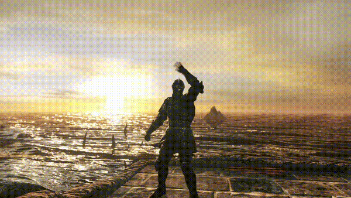

# 👋 Oieee, meu nome é <strong>Luca Merighi</strong> :D

<ul>
  <li>Certificado pela @Cod3rCursos</li>
  <li>Atualmente aluno no plano Ultimate da @Rocketseat 🚀</li>
  <li>Estudante de Frontend</li>
  <li>Nas horas vagas, edito vídeos, estudo música e mato chefes no Dark Souls 🔥</li>
</ul>

### Linguagens e Ferramentas que uso no meu dia-a-dia:

  
  
  
  

### Meu Certificado de mais orgulho  😄📄 

##### Contato: 
  - **Email:** whalesflying5@gmail.com

